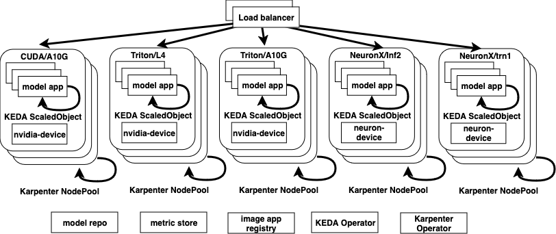
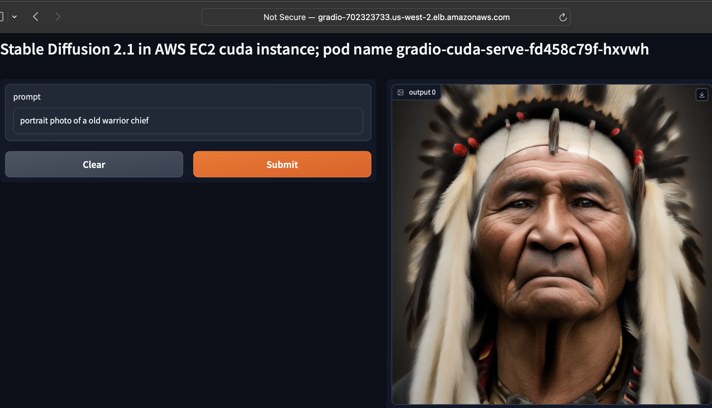
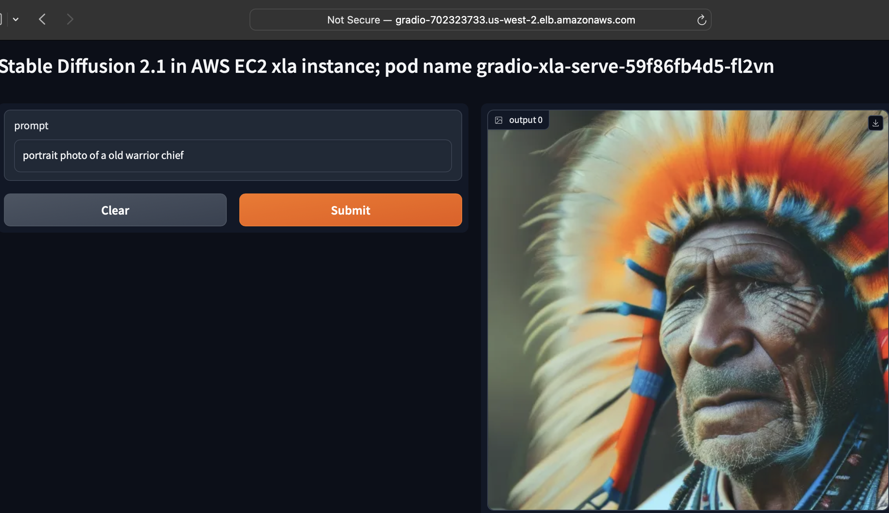
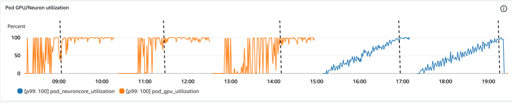
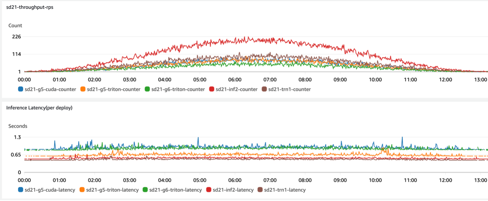
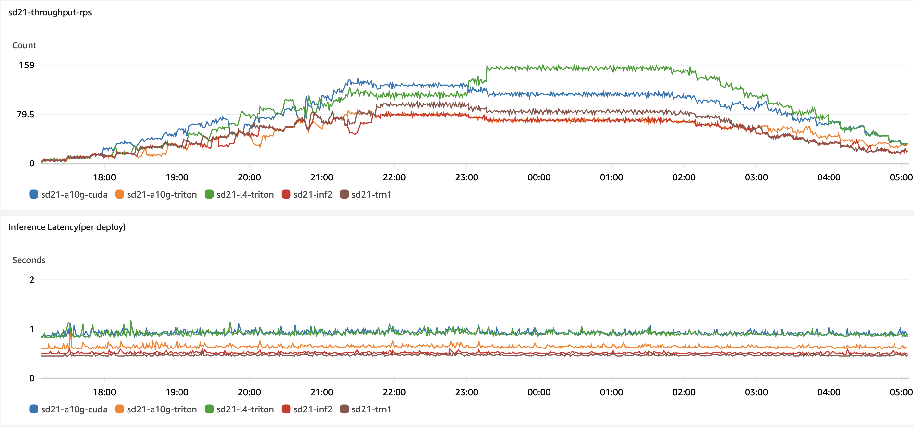
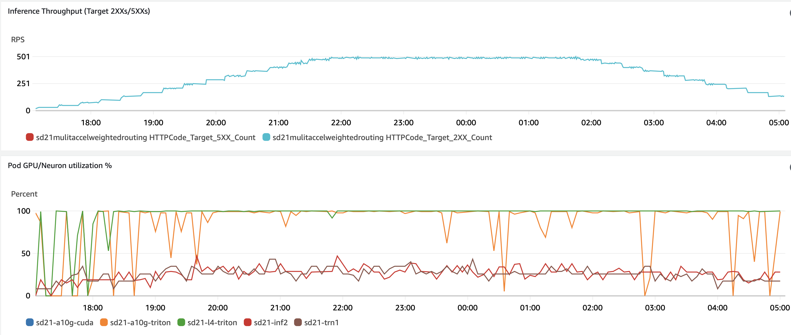
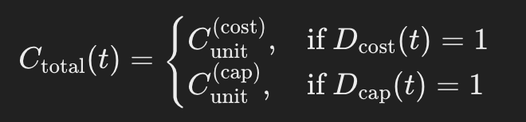
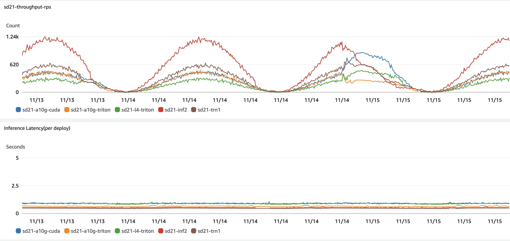
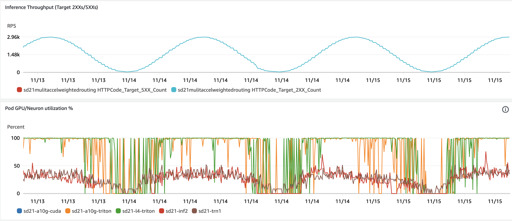

# scalable-hw-agnostic-inference

Growing interest in gen-AI applications is driving demand for compute accelerators, increasing inference costs and causing compute capacity shortages. This has led to more accelerator options, like NVIDIA GPUs and [AWS Inferentia](https://aws.amazon.com/machine-learning/inferentia/), both supporting common deep learning libraries such as PyTorch transformers and diffusers. AWS Inferentia, a custom AI chip for high-performance inference predictions, is particularly useful for optimizing cost and performance in production workloads. Adapting to Inferentia requires modifying deployments to use the Neuron SDK, including adjustments to model compilation and inference pipelines. Each compute accelerator necessitates changes in build and deployment methods, involving hardware-specific drivers and frameworks like [Neuron](https://awsdocs-neuron.readthedocs-hosted.com/), [Triton](https://openai.com/index/triton/), and CUDA.

This post outlines how to integrate AWS Inferentia instances into an existing Amazon EKS environment using GPU-based EC2 instances. Customers can mix compute accelerator architectures to enable their generative AI applications to leverage various Amazon EC2 accelerated compute types, optimizing for cost and resilience against capacity constraints. The blog presents two configurations: (1) One optimized for capacity, ensuring failover to available instances while maintaining latency; and (2) focused on cost, using weighted load balancing based on benchmarked inference costs to prioritize cost-effective deployment. This post emphasizes inference workloads, where a trained machine learning model processes new data to generate a response. We chose inference over training because it is dynamic, consumption-based, and flexible enough to run on different accelerators.

The solution uses [KEDA](https://keda.sh/), a Kubernetes-based autoscaler, to control the number of accelerated compute nodes based on optimal model throughput, which is measured by the Application Load Balancer (ALB). The blog also demonstrates the use of [Karpenter](https://karpenter.sh/) to simplify the provisioning of mixed compute resources in Kubernetes clusters.

In this exploration, we assess the benefits of various accelerators for inferencing the [Stable Diffusion](https://stability.ai/stable-image) model, a generative AI capable of producing unique, photorealistic images from text and image prompts. Our focus includes NVIDIA-based accelerators, such as the A10G (EC2 G5 instances) and L4 (EC2 G6 instances), along with AWS-specific options like Inferentia (EC2 inf2 instances) and Trainium (EC2 trn1 instances). We also extend our tooling to models such as [Mistral](https://huggingface.co/mistralai/Mistral-7B-Instruct-v0.3), [Llama](https://huggingface.co/meta-llama/Llama-3.2-1B), [BERT](https://huggingface.co/distilbert/distilbert-base-uncased), image classification [ViT](https://huggingface.co/tasks/image-classification), and object detection [YOLOS](https://huggingface.co/hustvl/yolos-tiny).

For our implementation, we utilize [HuggingFace](https://huggingface.co/) as the open-source platform, leveraging its tools and libraries for building, training, and deploying state-of-the-art models. To effectively use these accelerators, we employ Triton for NVIDIA's GPUs and PyTorch NeuronX for AWS Inferentia and Trainium. These tools are crucial as they construct the computational graph in advance, optimizing the inference process by compiling and arranging operations for enhanced performance.

To streamline our builds for each accelerator, we rely on [AWS Deep Learning Containers (DLC)](https://github.com/aws/deep-learning-containers) images. These images, integrated with the EKS Deep Learning AMI and maintained by AWS, significantly simplify the build process across different accelerator types.

## Solution overview
The solution involves deploying various Kubernetes constructs, including deployments (for the model app), services, and an [ALB ingress](https://kubernetes-sigs.github.io/aws-load-balancer-controller/) (acting as a load balancer). [Karpenter node pools](https://karpenter.sh/preview/concepts/nodepools/) power the deployment pods and launch nodes with the appropriate compute resources. Each deployment targets a specific accelerator, as the OCI image is built on accelerator-specific Deep Learning Containers (DLC).


*Figure 1-Solution overview*

The hardware accelerators advertise their capabilities as Kubernetes resources, such as accelerator cores (e.g., nvidia.com/gpu or aws.amazon.com/neuron). This enables Karpenter to right-size the EC2 instance it will launch. To facilitate this, we deploy [nvidia-device-plugin](https://github.com/NVIDIA/k8s-device-plugin?tab=readme-ov-file#deployment-via-helm) and [neuron-device-plugin](https://awsdocs-neuron.readthedocs-hosted.com/en/latest/containers/tutorials/k8s-setup.html) as daemon sets. These plugins allow Kubernetes to discover and utilize NVIDIA GPU and Inferentia Neuron resources available on a node. By providing visibility into available device resources, they enable Kubernetes to schedule GPU and Inferentia workloads efficiently. Additionally, these plugins allow the accelerator resources to be allocated to pods that require acceleration.

The NVIDA Karpenter nodepool, includes [g5](./nodepools/amd-nvidia-a10g-nodepool.yaml) and [g6](./nodepools/amd-nvidia-l4-nodepool.yaml) EC2 instances powered by NVIDIA A10G and L4 core respectvily:

```yaml
apiVersion: karpenter.sh/v1beta1
kind: NodePool
metadata:
  name: amd-nvidia
spec:
  template:
    spec:
      requirements:
        - key: kubernetes.io/arch
          operator: In
          values: ["amd64"]
        - key: karpenter.k8s.aws/instance-gpu-name
          operator: In
          values: ["a10g","l4"]
```
Similarly, the AWS Inferntia Karpenter nodepool includes [inf2](./nodepools/amd-neuron-inf2-nodepool.yaml) instances:

```yaml
apiVersion: karpenter.sh/v1beta1
kind: NodePool
metadata:
  name: amd-neuron
spec:
  template:
    spec:
      requirements:
        - key: kubernetes.io/arch
          operator: In
          values: ["amd64"]
        - key: karpenter.k8s.aws/instance-family
          operator: In
          values: ["inf2"]
```
Once a pod is scheduled on a node, the [PyTorch code](./app/run-sd.py) is invoked, initiating the HuggingFace pipeline customized for the specific accelerator it's running on. The Hugging Face pipeline simplifies the use of machine learning models by bundling all necessary steps into a convenient interface. These steps include preprocessing inputs, running inference with the model, and post-processing outputs, thus streamlining the workflow for the user.
For example, NeuronStableDiffusionPipeline is used for Inferentia, while StableDiffusionPipeline is employed for GPUs. After the appropriate pipeline is selected, it retrieves the pre-trained compiled model from Hugging Face and initiates the inference endpoint.

```bash
if device=='xla':
  from optimum.neuron import NeuronStableDiffusionPipeline
elif device=='cuda' or device=='triton':
  from diffusers import StableDiffusionPipeline
…
if device=='xla':
  pipe = NeuronStableDiffusionPipeline.from_pretrained(compiled_model_id)
elif device=='cuda' or device=='triton':
  pipe = StableDiffusionPipeline.from_pretrained(model_id,
         safety_checker=None,torch_dtype=DTYPE).to("cuda")
```
When [deploying](./sd21-a10g-cuda-deploy.yaml) a stable diffusion pipeline from Hugging Face, we employ a strategic approach to optimize the process. Instead of pulling the entire model, we selectively retrieve only the specific files required to load the model. These essential components include the model weights, configuration file, and any necessary tokenizer files for inference. By focusing on these crucial elements, we significantly expedite the deployment process. This targeted method not only speeds up deployment but also optimizes resource usage and minimizes overhead, resulting in a more efficient and streamlined operation overall.

In our solution, we've implemented a sophisticated traffic management system using AWS Application Load Balancer (ALB)-based Ingress. This system expertly directs incoming traffic to our [GPU-based and Inferentia-based node pools](./sd21-ing.yaml). At the heart of this setup is an Application Load Balancer, deployed via the [AWS Load Balancer Controller](https://kubernetes-sigs.github.io/aws-load-balancer-controller/), which efficiently distributes incoming requests across our various pods.

We've designed two distinct configurations to cater to different optimization priorities. Our capacity-optimized version employs a straightforward approach, using a single Kubernetes service that evenly distributes traffic across all deployment options through round-robin routing. This ensures maximum utilization of available resources.
For those more focused on cost efficiency, we've developed a cost-optimized option. This configuration takes a more nuanced approach to traffic management. It leverages the ingress level for traffic control, incorporating a specific annotation - `ingress.kubernetes.io/actions.weighted-routing`. This allows for more granular control over how traffic is distributed, potentially leading to significant cost savings.
By offering these two configurations, we provide the flexibility to prioritize either capacity utilization or cost optimization, allowing users to tailor the solution to their specific needs and constraints.

Additionally, pulling and loading the model takes 5-15 minutes for pod launches. For example, graph-based model inference like NeuronX requires loading the full model graph before handling inference requests, whereas Triton-based models support eager inference, processing graph operations as called and enabling transformations to run independently with immediate results. To avoid latency on the first real inference request, we call the model synthetically beforehand. 

Readiness and health probes are essential to inform the ALB which pods to target and which to recycle if they fail. To facilitate this, we implemented a gRPC API similar to the PyTorch Health Check API, which returns the status of a model in the ModelServer. This API defines the pod’s inference health and readiness to accept prediction requests. First, we define it in the pod specification:

```yaml
      containers:
      - name: app
      ...
       readinessProbe:
          httpGet:
            path: /readiness
            port: 8000
          initialDelaySeconds: 60
          periodSeconds: 10
```
Next, we define it in the ALB ingress:

```yaml
apiVersion: networking.k8s.io/v1
kind: Ingress
metadata:
  name: gradio-mix-ing
  annotations:
    kubernetes.io/ingress.class: alb
    alb.ingress.kubernetes.io/scheme: internet-facing
    alb.ingress.kubernetes.io/target-type: ip
    alb.ingress.kubernetes.io/healthcheck-path: /health
    alb.ingress.kubernetes.io/healthcheck-interval-seconds: '10'
    alb.ingress.kubernetes.io/healthcheck-timeout-seconds: '9'
    alb.ingress.kubernetes.io/healthy-threshold-count: '2'
    alb.ingress.kubernetes.io/unhealthy-threshold-count: '10'
    alb.ingress.kubernetes.io/success-codes: '200-301'
```

Following the deployment, we proceed to test the quality of the generated images by sampling the web app. Below are two examples:

*Figure 2 - GPU-based inference example for qualitative tests*

*Figure 3 - Neuron-based inference example for qualitative tests*

With the model inference endpoint now enabled on both GPU and Inferentia instances, we need to scale compute capacity to meet user demand and fine-tune performance. To achieve this, we use Amazon CloudWatch Container Insights with Enhanced Observability for EKS, which automatically discovers key health metrics from AWS accelerators like Inferentia and NVIDIA GPUs. Through Container Insights dashboards, we can visualize these pre-configured metrics, enabling effective monitoring of accelerated infrastructure and optimized workload usage.

We configure KEDA to trigger the Horizontal Pod Autoscaler (HPA) to scale the number of pods up or down when the throughput per pod reaches a threshold that maintains acceptable latency. This threshold is determined through experiments and observations, where we specifically look for the breaking point—when latency exceeds the set thresholds—on models loaded on Neuron and NVIDIA accelerators (Figure 4) or when the compute usage reaches over 80% (Figure 5). 
We load test the application for each compute accelerator and framework combination, such as Inf2, Trn1, or GPU with CUDA, NeuronX, or Triton. The results define the targetMetricValue that KEDA uses to scale the required number of k8s pods for each deployment combination. The breaking point occurs when throughput plateaus and latency exceeds 900 milliseconds. Below are the load tests conducted on A10G, L4 NVIDIA cores, and Inf2 and Trn1 Neuron cores. We skipped the default CUDA compiler with L4 NVIDIA, as it did not meet the minimum latency requirements.


*Figure 4 - Inference latency and throughput per deployment unit (model-device-framework)*


*Figure 5 - Compute accelerator utilization during load (neuron-core and GPU core)*

With the application's breaking points identified, we’ll configure four ScaledObject KEDA settings. Each configuration will specify which Deployment to control (e.g., `stable-diffusion-inf2`) and the AWS CloudWatch metric to use for pod throughput (defined in `metadata.expression`). We’ll apply targetMetricValue settings that correspond to the observed breaking points in Figures 4 and 5, and maintain a minimum capacity of 1 pod, indicated by `minReplicaCount`.

```yaml
apiVersion: keda.sh/v1alpha1
kind: ScaledObject
metadata:
  name: stable-diffusion-inf2-hpa
spec:
  scaleTargetRef:
    apiVersion: apps/v1
    kind: Deployment
    name: stable-diffusion-inf2
  minReplicaCount: 1
  triggers:
    - type: aws-cloudwatch
      metadata:
        namespace: hw-agnostic-infer
        expression: SELECT SUM("sd21-inf2-counter") FROM SCHEMA("hw-agnostic-infer")
        metricName: sd21-inf2-counter
        minMetricValue: "1"
        targetMetricValue: "105"
        metricUnit: Count
        awsRegion: us-west-2
```
### Capacity dynamics
Our solution distributes traffic across multiple capacity pools that deploys $D_i$ based on available capacity, cost and efficiency. It also supports dynamic allocation $w_i$ that are adjusted over time based on real-time availability and workload demands. Finally, the solution achieves a smooth transition across pools avoiding abrupt changes as follow:

$$\max_{w_1(t), \dots, w_N(t)} \int_{0}^{T_{\text{end}}} 
\left( 
\sum_{i=1}^N T_{\text{throughput}}^{(i)}(t) - \lambda \sum_{i=1}^N w_i(t) C_{\text{unit}}^{(i)}
\right) dt $$

- $w_i(t)$: Represents the routing weights for $D_i$.
- $T_{\text{throughput}}^{(i)}(t)$: Throughput contribution from $D_i$ at time $t$.
- $C_{\text{unit}}^{(i)}$: Cost per inference from $D_i$.
- $\lambda$: A trade-off parameter balancing throughput and cost optimization.

In practical scenarios, the majority of inference requests can be handled effectively by a cost-optimized pool, such as Inf2. Capacity-optimized pools are reserved as a fallback option, stepping in only when the cost-optimized resources are insufficient to meet demand. This approach balances resource efficiency with reliability. Also, managing continuous weight distributions across multiple pools—especially with five or more—introduces unnecessary complexity for minimal performance gains. By grouping pools into two distinct categories, the system achieves better scalability and more predictable behavior, simplifying resource management without sacrificing performance. Finally, a binary step function ensures the system prioritizes the use of cost-optimized pools wherever possible, effectively minimizing operational expenses. Meanwhile, the fallback mechanism guarantees that throughput requirements are met, even during periods of constrained capacity. This approach strikes an optimal balance between cost efficiency and performance reliability. Therefore we simplified the general case to a two-step function that supports **Cost-optimized** deployment (option 1) with lowest $C_{\text{unit}}^{(i)}$ e.g., inf2; and **Capacity-optimized** deployment (option 2) with higher $C_{\text{unit}}^{(i)}$ but with greater availability. 

This grouping simplifies the optimization function to:

$$\max_{w_{\text{cost}}(t), w_{\text{cap}}(t)} \int_{0}^{T_{\text{end}}} 
\left( 
T_{\text{throughput}}(t) - \lambda C_{\text{total}}(t)
\right) dt $$

where:
- $T_{\text{throughput}}(t)=w_{cost}(t)T_{cost}(t)+w_{cap}(t)T_{cap}(t)$
- $C_{total}(t)=w_{cost}(t)C_{unit}^{(cost)}+w_{cap}(t)C_{unit}^{(cost)}$
- $w_{cost}(t)+w_{cap}(t)=1$

### Option 1 - Compute cost optimized configuration
Next, we calculate cost of inference per second for each deployment unit based on the breaking points. 

| Deployment Unit       | Cost of Compute / Hour     | Throughput | Cost of Inference / Second |
|-----------------------|----------------------------|------------|----------------------------|
| (sd21, inf2, neuron)  | inf2.xlarge / $0.7582      | 105        | 0.00733                    |
| (sd21, trn1, neuron)  | trn1.2xlarge / $1.3438     | 130        | 0.01023                    |
| (sd21, g5, triton)    | g5.xlarge / $1.0060        | 90         | 0.01118                    |
| (sd21, g6, triton)    | g6.xlarge / $0.8048        | 61         | 0.01320                    |
| (sd21, g5, cuda)      | g5.xlarge / $1.0060        | 60         | 0.01677                    |

*Table 1 - Deployment unit cost of inference*

The cost of inference per second determines the weights assigned to each deployment unit. We configure a Kubernetes service for each deployment to control traffic routing and assign these services to ALB target groups as follows:

```json
{
 "type":"forward","forwardConfig":{
 "targetGroups":[
   {
     "serviceName":"sd21-g5-cuda",
     "servicePort":80,
     "weight":15
   },
   {
     "serviceName":"sd21-g5-triton",
     "servicePort":80,
     "weight":15
   },
   {
     "serviceName":"sd21-g6-triton",
     "servicePort":80,
     "weight":10
   },
   {
     "serviceName":"sd21-inf2",
     "servicePort":80,
     "weight":40
   },
   {
     "serviceName":"sd21-trn1",
     "servicePort":80,
     "weight":20
    }
  ]
}}
```

Figure 6 illustrates the optimal compute allocation based on inference cost. The `sd21-inf2` deployment handled 40% of total requests with minimal latency, while the remaining deployments were allocated per the ALB ingress configuration. Figure 6 displays effective throughput, indicated by HTTP code 200 (successful requests) and HTTP code 500 (failures), while maintaining optimal utilization levels—70% for Neuron cores and 90% for GPU cores.


*Figure 6 - Cost optimized deployment with weighted load balancing*


*Figure 7 - Cost optimized deployment HTTP throughput and compute usage*


### Option 2 - Compute capacity optimized configuration
When compute capacity is limited, your inference system must continue serving user requests while minimizing latency and maximizing application availability. To achieve this, we normalized the throughput of deployment units listed in Table 1 and consolidated the Kubernetes services into a single service that uses round-robin to distribute requests across deployment units, allocating resources evenly based on available capacity.

The adjusted throughput per deployment unit aims to approximate uniformity, enabling nearly equal throughput across units as the load balancer distributes requests in a round-robin fashion. However, throughput also factors in both maximum and average latency per unit, allowing faster options like sd21-inf2 and sd21-trn1 to handle a higher volume of requests when possible. We used the deployment unit maximum throughput (Table 1) and observed latency to calculate the target throughput as follow:

$$\text{Target Throughput} = \frac{\sum \text{Max Throughput (RPS)}}{\text{Number of Deployment Units}}$$

Then for each deployment unit, we set the Adjusted Throughput to the minimum of either:

$$\text{Adjusted Throughput}_i = \min(\text{Target Throughput}, \text{Max Throughput}_i)$$

| Deployment&nbsp;Unit       | Latency&nbsp;(sec) | Max&nbsp;Throughput&nbsp;(RPS) | Cost&nbsp;of&nbsp;Inference&nbsp;/&nbsp;Second | Adjusted&nbsp;Throughput |
|----------------------------|--------------------|--------------------------------|----------------------------------------------|---------------------------|
| (sd21,&nbsp;inf2,&nbsp;neuron)  | 0.67           | 105                           | 0.00733                                     | 89.2                      |
| (sd21,&nbsp;trn1,&nbsp;neuron)  | 0.51           | 130                           | 0.01023                                     | 89.2                      |
| (sd21,&nbsp;g5,&nbsp;triton)    | 0.68           | 90                            | 0.01118                                     | 89.2                      |
| (sd21,&nbsp;g6,&nbsp;triton)    | 0.96           | 61                            | 0.01320                                     | 61.0                      |
| (sd21,&nbsp;g5,&nbsp;cuda)      | 0.92           | 60                            | 0.01677                                     | 60.0                      |

*Table 2 - Deployment unit throughput optimized for compute capacity*

Figure 8 illustrates the system's response to a sudden drop in supply, where a limit was imposed on L4 from 21:20 to 23:20. During this period, inf2 and trn1 pods started up, processed the required requests, and maintained overall system throughput without errors (as shown in Figure 9). At 23:20, the limit on L4 was removed, allowing L4-based pods to handle more requests, while inf2 and trn1 pods stabilized.

*Figure 8 - Capacity optimized deployment with equal round-robin load balancing*


*Figure 9 - Capacity optimized deployment HTTP throughput and compute usage*

### Option 3 - Failover to compute-optimized configuration with fallback to cost-optimized

In simplified case (option1 and option2), the system switches between only two states out of five deployment units based on the availability of cost-optimized capacity $A_{cap}^{(cost)}(t)$:
- $D_{cost}(t)$ is a binary indicator for the cost-optimized state.
- $D_{cap}(t)=1-D_{cost}(t)$ is a binary indicator for the capacity-optimized state.

The controller switching logic is:


$$ w_{\text{cost}}(t) = D_{\text{cost}}(t), \quad w_{\text{cap}}(t) = 1 - D_{\text{cost}}(t) $$

The resulting throughput and cost are determined by:



By switching to step functions, we replace the continuous allocation $w_i(t)$ with binary decisions $D_{\text{cost}}(t)$ and $D_{\text{cap}}(t)$, as this eliminates the need for dynamically balancing traffic across $N$ (currently only 5 deployment units). This approach simplifies the controller and creates clear transitions between cost-optimized and capacity-optimized states, governed by $A_{\text{capacity}}^{(\text{cost})}$. 

In the experiment, the **insufficient capacity for Inf2** was simulated on **11/14**, prompting the controller to initiate a failover to the compute-optimized configuration to maintain throughput. The controller seamlessly transitioned to this configuration, managing the remaining load of the cycle without impacting latency, as seen in the consistent inference performance.

At the **beginning of the next wave on 11/15**, when sufficient Inf2 capacity became available, the controller detected this change and automatically reverted to the cost-optimized allocation. This fallback ensured that the system could capitalize on cost savings while meeting performance requirements, as reflected in the stable throughput and controlled utilization of resources.


*Figure 10 - Failover to capacity-optimized configuration with fallback to cost-optimized throughput by capacity pool*

*Figure 11 - Failover to compute-optimized configuration with fallback to cost-optimized total throughput and utilization*
