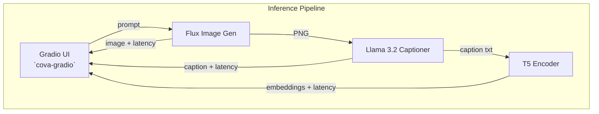
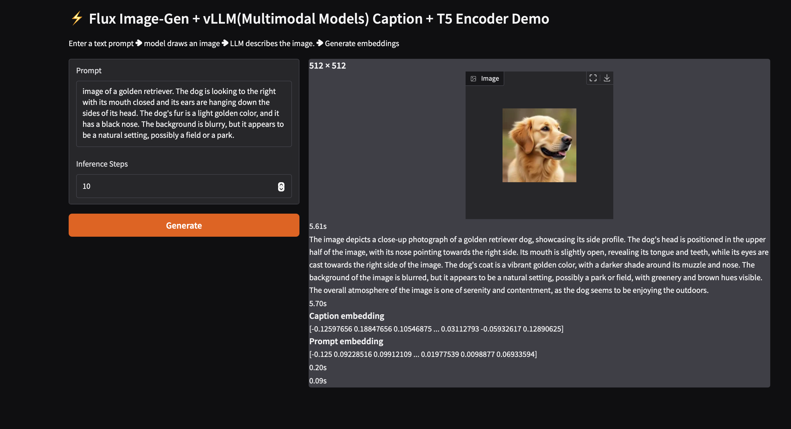

# ⚡ Image generation va;idation (cova) Demo – Multimodal Inference on NxD (EKS centric)

A Gradio web app that chains **three model micro‑services**:

| order | micro‑service | purpose |
|-------|---------------|---------|
| ① | **Flux Image‑Gen** | turns a text prompt into a PNG | 
| ② | **Llama 3.2 Captioner** | describes the generated image |
| ③ | **T5 Encoder** | embeds (a) the caption and (b) the original prompt |

All four pieces (①–③ + the Gradio orchestrator) are independent Kubernetes
Deployments, each fronted by a ClusterIP Service.  
The Gradio pod fans‑out asynchronous calls and renders latencies + outputs.

---

## 🖼️ Architecture



## Files in this repo

| file | kind | what it defines |
|------|------|-----------------|
| `cova-gradio-config.yaml` | ConfigMap | **models.json** consumed by the Gradio pod |
| `cova-gradio-deploy.yaml` | Deployment + Service | Gradio orchestrator |
| `mllama-32-11b-vllm-trn1-config.yaml` | ConfigMap | HF token / Neuron overrides for the captioner |
| `mllama-32-11b-vllm-trn1-deploy.yaml` | Deployment + Service | vLLM caption model |
| `t5-neuron-model-api.yaml` | Deployment + Service | T5 encoder |
| `cova-ingress.yaml` | Ingress / IngressRoute | optional public entry‑point |
| `cova_gradio_m.py` | source | orchestrator code (image → caption → embeddings) |


## 🔧 Key configuration (models.json)

```json
[
  {
    "name": "512 × 512",
    "host_env":               "FLUX_NEURON_512X512_MODEL_API_SERVICE_HOST",
    "port_env":               "FLUX_NEURON_512X512_MODEL_API_SERVICE_PORT",
    "height": 512,
    "width":  512,

    "caption_host_env":       "MLLAMA_32_11B_VLLM_TRN1_SERVICE_HOST",
    "caption_port_env":       "MLLAMA_32_11B_VLLM_TRN1_SERVICE_PORT",
    "caption_max_new_tokens": 1024,

    "encoder_host_env":       "T5_NEURON_MODEL_API_SERVICE_HOST",
    "encoder_port_env":       "T5_NEURON_MODEL_API_SERVICE_PORT",
    "encoder_max_new_tokens": 256
  }
]
```

## 🚀 Deploy

```bash
# 1 – ConfigMaps
kubectl apply -f cova-gradio-config.yaml
kubectl apply -f mllama-32-11b-vllm-trn1-config.yaml

# 2 – Model back‑ends
kubectl apply -f mllama-32-11b-vllm-trn1-deploy.yaml
kubectl apply -f t5-neuron-model-api.yaml

# 3 – Front‑end
kubectl apply -f cova-gradio-deploy.yaml

# 4 – Ingress (optional)
kubectl apply -f cova-ingress.yaml
```

## 🏃 Smoke test (curl)

```bash
curl -X POST http://$T5_NEURON_MODEL_API_SERVICE_HOST:$T5_NEURON_MODEL_API_SERVICE_PORT/generate \
     -H 'Content-Type: application/json'                       \
     -d '{"prompt": "Hello world", "max_new_tokens": 32}' | jq
```

Outputs Base64‑encoded embedding string + latency in seconds.



We can see the time it took to generate the image (5.61s), the caption (5.70s), the caption embeddings (0.20s) and the prompt embeddings (0.09s). 

## 🧹 Cleanup

```bash
kubectl delete -f cova-ingress.yaml --ignore-not-found
kubectl delete -f cova-gradio-deploy.yaml
kubectl delete -f t5-neuron-model-api.yaml
kubectl delete -f mllama-32-11b-vllm-trn1-deploy.yaml
kubectl delete -f cova-gradio-config.yaml
kubectl delete -f mllama-32-11b-vllm-trn1-config.yaml
```
