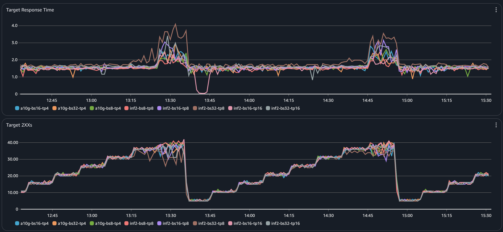
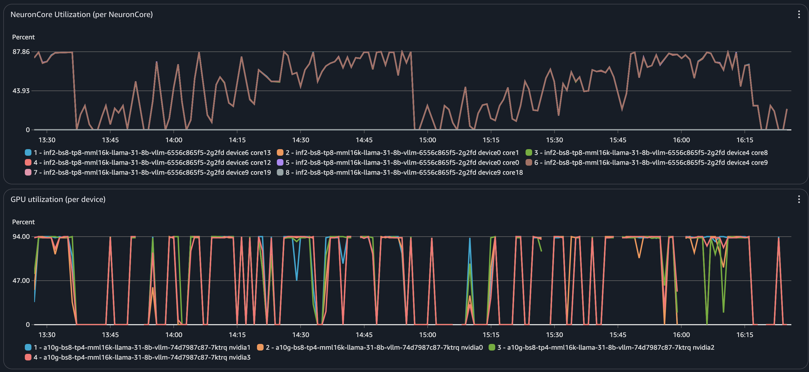

# Cost-Effective LLM Serving with Optimal TP/DP on EKS using Inferentia2 and GPU

To help a customer reduce inference costs and improve infrastructure resilience beyond GPU-only deployments, we evaluated the performance of `meta/llama-3.1-8B` with 16K input and 512 output tokens across both NVIDIA and Inferentia2 instances.

Starting from their existing `g5.12xlarge` setup, we tuned **tensor parallelism (TP)** to meet a 1.5-second latency target, then scaled via **data parallelism (DP)** to maximize throughput. Using **EKS with Karpenter** and the **AWS Load Balancer Controller**, we declaratively orchestrated hardware-specific deployments—selecting optimal instance types and resource constraints.

The software stack, centered on **vLLM**, abstracts away accelerator differences and is backed by our **DLC** and **DLAMI** layers, enabling a unified, production-ready inference pipeline across GPU and Neuron environments.

---

## Evaluation Setup

We began our evaluation using the customer’s existing setup on `g5.12xlarge`, which provides access to **4 A10G GPUs**. The EKS cluster was provisioned using **Karpenter**, allowing dynamic scaling of compute nodes.

Key components:

- **Dedicated GPU node pools** and `EC2NodeClass` resources (see [`scalable-hw-agnostic-inference`](https://github.com/aws-samples/scalable-hw-agnostic-inference)).
- **Amazon CloudWatch Container Insights** enabled for visibility into GPU utilization, memory, and CPU.
- **vLLM** deployments with variable configurations:
  - `bs8–tp4`
  - `bs16–tp4`
  - `bs32–tp4`

We measured:
- **Throughput**
- **p95 latency**

Our goal: Find the TP setting that meets ≤1.5s latency while maximizing **throughput per dollar**.

---

## Load Testing

To evaluate performance under load:

- We launched the script in `load.yaml` to issue inference requests with fixed token lengths.
- An **AWS Load Balancer** fronted the service.
- CloudWatch metrics used:
  - `TargetResponseTime` (latency)
  - `HTTPCode_Target_2XX_Count` (successful responses)
- Load controller (`load-ctl.yaml`) gradually increased request rate until latency >1.5s.

This allowed us to identify the **breaking point** for each configuration.

---

## Results Summary

The chart below summarizes performance under load:

- All configurations stayed within latency bounds up to **~37 RPS**.
- Beyond 37 RPS, multiple configurations exceeded the 1.5s threshold.
- We set **37 RPS** as the throughput ceiling for latency-constrained setups.

### Optimal TP Configurations:

| Platform        | Configuration    | Rationale                                      |
|----------------|------------------|------------------------------------------------|
| `g5.12xlarge`  | `a10g-bs8-tp4`   | All 4 GPUs used, meets latency, efficient     |
| `inf2.48xlarge`| `inf2-bs8-tp8`   | 4 Neuron devices (8 cores), efficient use     |

---

## Utilization Observations

We validated TP choices by monitoring **GPU** and **NeuronCore** utilization:

- **inf2-bs8-tp8** and **a10g-bs8-tp4** both showed **near-peak utilization**.
- Minimal idle time across all cores/devices.
- Confirms no underutilization and hardware saturation is achieved.

---

## Data Parallel Scaling

With optimal TP set, we scaled using **Data Parallelism (DP)**:

| Instance         | Pods per Instance | Total RPS | Hourly Cost | RPS per $ |
|------------------|-------------------|-----------|-------------|-----------|
| `g5.12xlarge`    | 1 × `a10g-bs8-tp4`| 36        | $5.672      | 6.35      |
| `inf2.48xlarge`  | 3 × `inf2-bs8-tp8`| 114       | $12.9813    | 8.78      |

**Inference Cost Comparison:**

- **Throughput gain**: `114 / 36 ≈ 3.17×`
- **Cost increase**: `12.9813 / 5.672 ≈ 2.29×`
- **Efficiency**: `8.78 / 6.35 ≈ 1.38×` → **~38% better RPS per dollar**

---

## Conclusion

Despite higher per-hour costs, **Inferentia2 (inf2.48xlarge)** outperformed NVIDIA GPU (g5.12xlarge) in both throughput and cost-efficiency:

- Better hardware saturation
- More scalable under DP
- Unified with vLLM for consistent deployment

This makes **Inferentia2 the preferred choice** for scalable, cost-efficient LLM inference on EKS.
